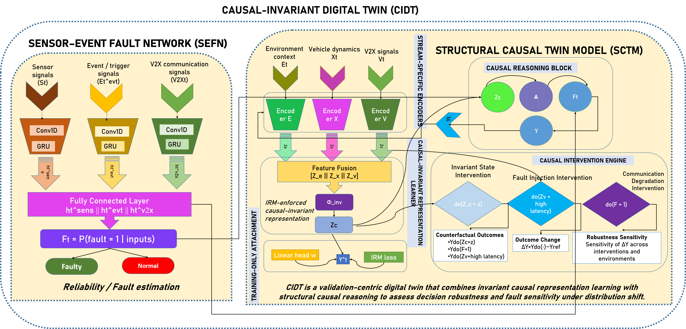

# Causal-Invariant Digital Twin (CIDT)

### Robust Autonomous Vehicle Decision Validation under 5G-V2X Distribution Shifts  
**IEEE Transactions–Ready Research Repository**

---

<p align="center">
  
</p>

---

## 🔍 Overview

Autonomous Vehicle (AV) decision-making systems increasingly rely on **V2X communication, heterogeneous sensing, and learned prediction models**.  
However, **most Digital Twin (DT) frameworks remain correlation-driven**, leading to **catastrophic failure under distribution shifts** such as:

- unseen traffic patterns,
- new driver behaviors,
- degraded V2X reliability,
- weather and sensing perturbations.

This repository presents the **first end-to-end Causal-Invariant Digital Twin (CIDT)** framework that **explicitly validates AV decisions under distribution shifts using causal invariance and intervention-based simulation**.

---

## 🚨 Core Research Gap (Why This Work Exists)

| Limitation in Existing DTs | Consequence |
|---------------------------|-------------|
| Correlation-based validation | Unsafe decision transfer |
| No causal disentanglement | Spurious robustness |
| No interventions | No counterfactual guarantees |
| Predictive-only evaluation | False sense of safety |

**CIDT directly addresses all four gaps.**

---

## 📚 Literature Comparison: Digital Twin Decision Validation

**Legend:**  
✔ Explicitly supported &nbsp;&nbsp; ✘ Not supported &nbsp;&nbsp; ◐ Partial / indirect

<table>
<thead>
<tr style="background-color:#0f172a;color:white;">
<th>Work</th>
<th>Primary Technique</th>
<th>Eval. Focus</th>
<th>Key Limitation</th>
<th>DT</th>
<th>Learn</th>
<th>V2X</th>
<th>Causal</th>
<th>Interv.</th>
<th>Edge</th>
<th>Ethics</th>
</tr>
</thead>
<tbody>

<tr style="background-color:#f8fafc;">
<td>Wu et al. (2025)</td>
<td>V2X corridor DT sync</td>
<td>Integration accuracy</td>
<td>No decision robustness</td>
<td style="color:green;">✔</td>
<td style="color:red;">✘</td>
<td style="color:green;">✔</td>
<td style="color:red;">✘</td>
<td style="color:red;">✘</td>
<td style="color:red;">✘</td>
<td style="color:red;">✘</td>
</tr>

<tr style="background-color:#ecfeff;">
<td>Li et al. (2025)</td>
<td>Risk-aware mobility DT</td>
<td>Situational awareness</td>
<td>Correlation-based</td>
<td style="color:green;">✔</td>
<td style="color:green;">✔</td>
<td style="color:green;">✔</td>
<td style="color:red;">✘</td>
<td style="color:red;">✘</td>
<td style="color:#f59e0b;">◐</td>
<td style="color:red;">✘</td>
</tr>

<tr style="background-color:#fefce8;">
<td>Xun et al. (2025)</td>
<td>DT trajectory prediction</td>
<td>Prediction accuracy</td>
<td>Shift sensitive</td>
<td style="color:green;">✔</td>
<td style="color:green;">✔</td>
<td style="color:red;">✘</td>
<td style="color:red;">✘</td>
<td style="color:red;">✘</td>
<td style="color:red;">✘</td>
<td style="color:red;">✘</td>
</tr>

<tr style="background-color:#fff7ed;">
<td>Lim et al. (2024)</td>
<td>Graph-based causal DT</td>
<td>Root-cause inference</td>
<td>Not AV decisions</td>
<td style="color:green;">✔</td>
<td style="color:green;">✔</td>
<td style="color:red;">✘</td>
<td style="color:green;">✔</td>
<td style="color:red;">✘</td>
<td style="color:red;">✘</td>
<td style="color:red;">✘</td>
</tr>

<tr style="background-color:#fee2e2;">
<td>Thomas et al. (2023)</td>
<td>Causal imitation learning</td>
<td>Generalization</td>
<td>No safety validation</td>
<td style="color:green;">✔</td>
<td style="color:green;">✔</td>
<td style="color:green;">✔</td>
<td style="color:green;">✔</td>
<td style="color:red;">✘</td>
<td style="color:red;">✘</td>
<td style="color:red;">✘</td>
</tr>

<tr style="background-color:#e0f2fe;">
<td><b>SEFN (2026)</b></td>
<td>Event-driven fault modeling</td>
<td>Fault reliability</td>
<td>—</td>
<td style="color:red;">✘</td>
<td style="color:green;">✔</td>
<td style="color:green;">✔</td>
<td style="color:red;">✘</td>
<td style="color:red;">✘</td>
<td style="color:green;">✔</td>
<td style="color:green;">✔</td>
</tr>

<tr style="background-color:#dbeafe;">
<td><b>SCTM (2026)</b></td>
<td>Structural causal DT</td>
<td>Causal attribution</td>
<td>No invariance</td>
<td style="color:green;">✔</td>
<td style="color:red;">✘</td>
<td style="color:green;">✔</td>
<td style="color:green;">✔</td>
<td style="color:green;">✔</td>
<td style="color:green;">✔</td>
<td style="color:green;">✔</td>
</tr>

<tr style="background-color:#bbf7d0;">
<td><b>CIDT (2026)</b></td>
<td><b>Causal-invariant DT</b></td>
<td><b>Robust decision validation</b></td>
<td><b>—</b></td>
<td style="color:green;font-weight:bold;">✔</td>
<td style="color:green;font-weight:bold;">✔</td>
<td style="color:green;font-weight:bold;">✔</td>
<td style="color:green;font-weight:bold;">✔</td>
<td style="color:green;font-weight:bold;">✔</td>
<td style="color:green;font-weight:bold;">✔</td>
<td style="color:green;font-weight:bold;">✔</td>
</tr>

</tbody>
</table>

---

## 📌 Paper Contributions

This repository accompanies the paper:

**“Causal-Invariant Digital Twin for Robust Autonomous Vehicle Decision Validation under 5G-V2X Distribution Shifts”**

Key contributions include causal-invariant validation, sensor–event fault modeling, structural causal twins with interventions, ethical AI robustness, and edge-feasible deployment.

---

## 📊 Dataset: Driver Behavior and Route Anomaly Detection (DBRA24)

**Dataset Link:**  
https://www.kaggle.com/datasets/datasetengineer/driver-behavior-and-route-anomaly-dataset-dbra24

**BibTeX citation:**
```bibtex
@misc{dbra24kaggle,
  author       = {Dataset Engineer},
  title        = {{Driver Behavior and Route Anomaly Detection (DBRA24)}},
  howpublished = {\url{https://www.kaggle.com/datasets/datasetengineer/driver-behavior-and-route-anomaly-dataset-dbra24}},
  year         = {2024},
  note         = {Accessed: 2025-10-08}
}
```

---

## 🧠 CIDT Architecture

<p align="center">
  
</p>

---

## 🔁 Interventional Validation

<p align="center">
  
</p>

CIDT evaluates decisions under explicit do-interventions on V2X latency, driver behavior, and environmental conditions.

---

## 📂 Repository Structure

```
Code/        → Training and evaluation scripts
Results/     → Section-wise experimental outputs (A–L)
figs/        → Publication-quality figures
README.md    → This document
```

---

## 🧾 Reproducibility

- Metrics provided in CSV / XLSX / TXT
- Deterministic seeds and logged runs
- Apache 2.0 license

---

## 🏁 Key Takeaway

**Robustness without causality is illusory.**  
CIDT validates autonomous decisions under distribution shifts using causal invariance and interventions.

---

## 📜 License
Apache License 2.0

---

## 📬 Contact
For questions or reproducibility inquiries, please open a GitHub issue.
