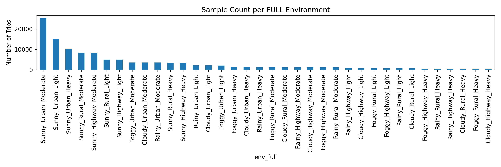

# Section A — Dataset Failure Environments

This folder contains **all visual figures, text summaries, and structured data files**
used in **Section A (Dataset and Failure Environment Analysis)** of the
*Causal-Invariant Digital Twin (CIDT)* study.

All figures are embedded below so they are **visibly rendered in GitHub**.

---

## 📊 Figures (Rendered)

### Dataset Environment Balance

The following figure visualizes the full dataset balance across all environment
categories (e.g., weather, road type, traffic conditions).  
This figure is used to motivate distribution-shift-aware and causal-invariant modeling.

**File:** `env_full_balance.png`  
**Used in Paper:** Section A — Dataset Characterization

---

## 📄 Text Files (Failure Statistics)

### Environment-wise Failure Distribution

**File:** `SectionA_Dataset_Failure_Environments-failure_distribution.txt`

This text file reports:
- Failure counts per environment
- Failure proportions across environment categories

**Role in Paper:**
- Section A — Failure Environment Analysis
- Supports claims on environment-dependent failure skew

---

## 🗂️ Tables / Structured Data (Machine-Readable)

### Environment Cardinality Metadata

**File:** `environment_cardinality.json`

This JSON file acts as a **table-equivalent artifact**, containing:
- Environment identifiers
- Sample cardinality per environment

**Role in Paper:**
- Dataset transparency
- Reproducibility
- Programmatic loading for analysis scripts

---

## 📌 Artifact Summary

| Type | File |
|----|----|
| Figure | `env_full_balance.png` |
| Text | `SectionA_Dataset_Failure_Environments-failure_distribution.txt` |
| Table / Metadata | `environment_cardinality.json` |
| Documentation | `readme.md` |

---

## 🔍 Role in CIDT Evaluation

These artifacts jointly support:
- Explicit characterization of environment-induced distribution shifts
- Transparent dataset reporting (IEEE Transactions requirement)
- Justification for causal-invariant and interventional evaluation in CIDT

---

## 📖 Related Paper Section
**Section:** Section A — Dataset and Failure Environment Analysis  
**Project:** Causal-Invariant Digital Twin for Robust Autonomous Decision Validation
