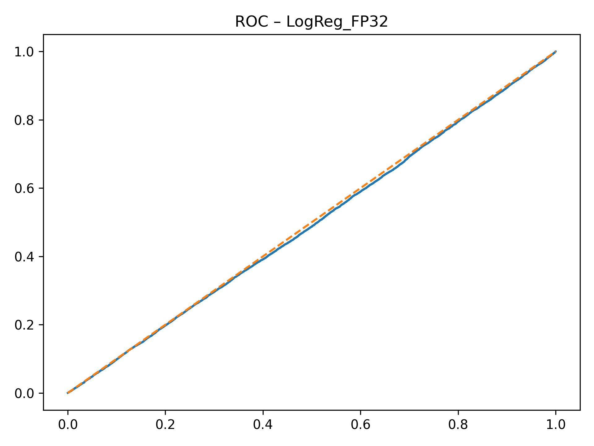
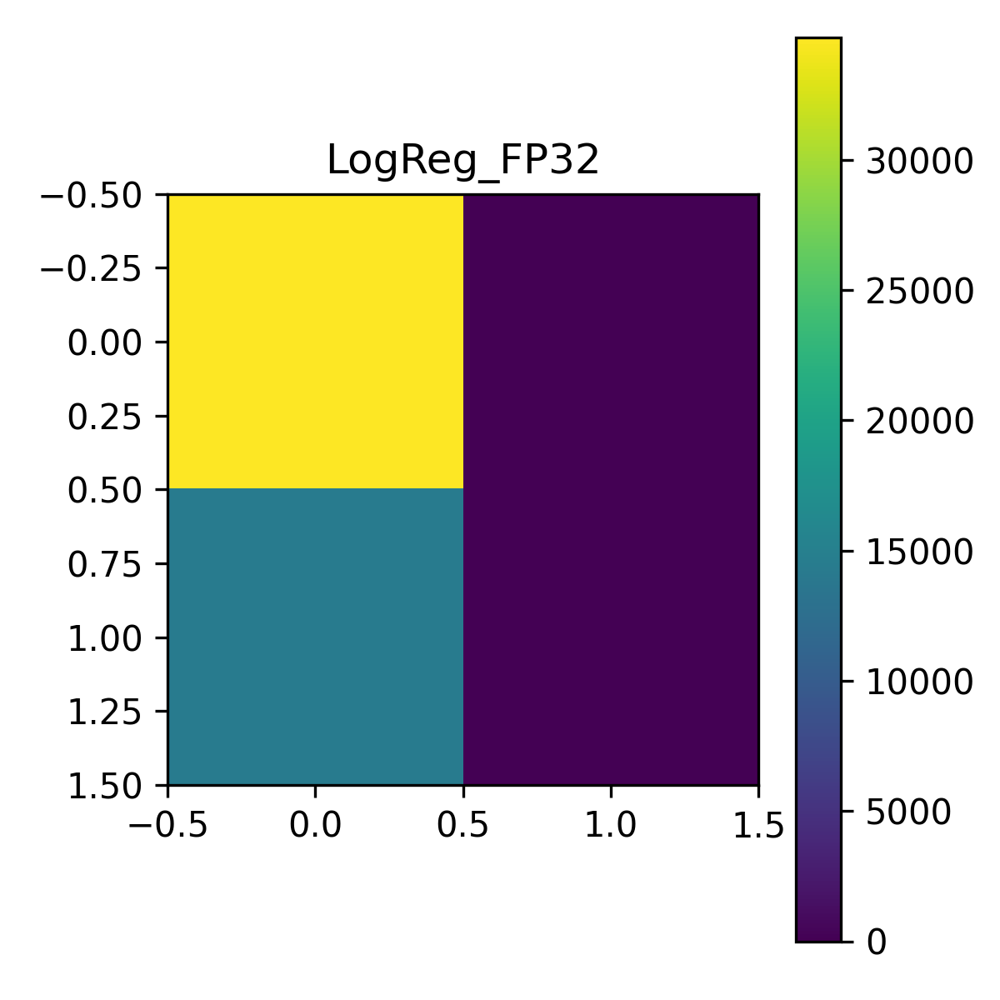
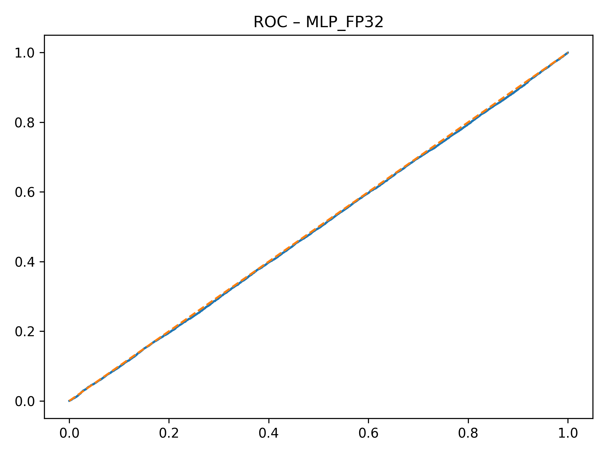
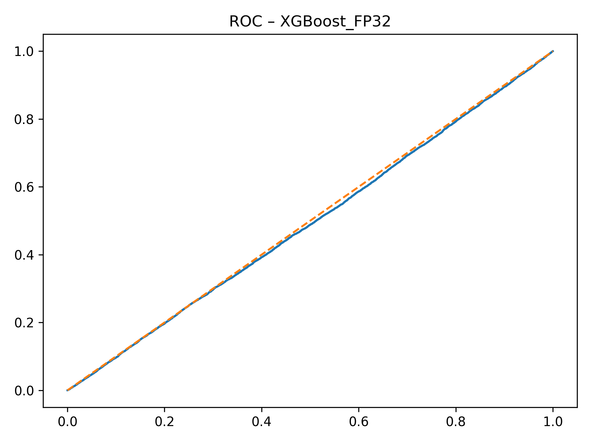

# Section B — Baseline Models (Ablation 1)

This directory contains **baseline model artifacts, evaluation figures, trained weights, and result summaries**
used in **Section B (Baseline Model Evaluation and Ablation Study)** of the
*Causal-Invariant Digital Twin (CIDT)* framework.

All figures are **explicitly embedded below** so they render correctly on GitHub.

---

## 📊 Logistic Regression (FP32)

### ROC Curve

### Confusion Matrix

**Model File:** `LogReg_FP32.pkl`  
**Precision:** FP32  
**Role:** Linear ERM baseline for decision risk prediction

---

## 📊 Multi-Layer Perceptron (MLP – FP32)

### ROC Curve

### Confusion Matrix

**Model File:** `MLP_FP32.pkl`  
**Precision:** FP32  
**Role:** Nonlinear ERM baseline

---

## 📊 Multi-Layer Perceptron (MLP – INT8)

**Model File:** `MLP_INT8.pt`  
**Precision:** INT8 (quantized)  
**Role:** Edge-deployment baseline used to evaluate accuracy–latency trade-offs  
*(No separate ROC/CM plotted; evaluated via summary metrics)*

---

## 📊 XGBoost (FP32)

### ROC Curve

### Confusion Matrix

**Model File:** `XGBoost_FP32.pkl`  
**Precision:** FP32  
**Role:** Tree-based ensemble baseline

---

## 🗂️ Supporting Artifacts

### Feature Normalization
- **File:** `feature_scaler.pkl`
- **Purpose:** Standardizes input features consistently across all baseline models

### Aggregate Results
- **File:** `SectionB_All_Baseline_Results.txt`
- **Contents:**
  - AUROC
  - Accuracy
  - Balanced Accuracy
  - False-safe rate
  - Model-wise comparison

---

## 📌 Artifact Summary

| Category | Files |
|--------|------|
| ROC Figures | `LogReg_FP32_roc.png`, `MLP_FP32_roc.png`, `XGBoost_FP32_roc.png` |
| Confusion Matrices | `LogReg_FP32_confusion.png`, `MLP_FP32_confusion.png`, `XGBoost_FP32_confusion.png` |
| Models | `LogReg_FP32.pkl`, `MLP_FP32.pkl`, `MLP_INT8.pt`, `XGBoost_FP32.pkl` |
| Preprocessing | `feature_scaler.pkl` |
| Text Results | `SectionB_All_Baseline_Results.txt` |
| Documentation | `readme.md` |

---

## 🔍 Role in CIDT Study

These baseline models establish:
- Performance ceilings of correlation-driven ERM approaches
- Failure patterns under distribution shifts
- Motivation for causal-invariant and interventional digital twin validation

They are directly compared against **SCTM and CIDT models** in later sections.

---

## 📖 Related Paper Section
**Section:** Section B — Baseline Models and Ablation Study  
**Project:** Causal-Invariant Digital Twin for Robust Autonomous Decision Validation

