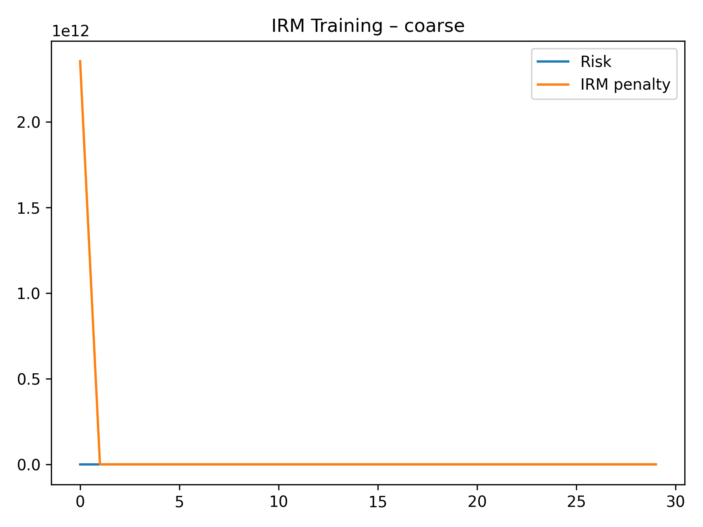
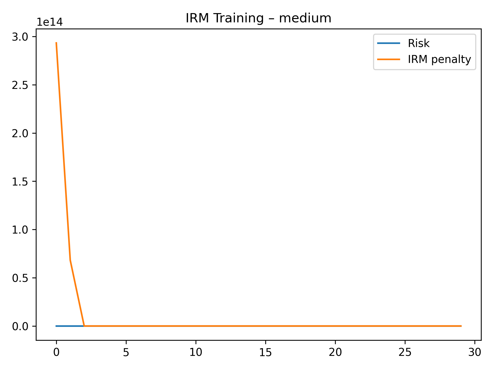
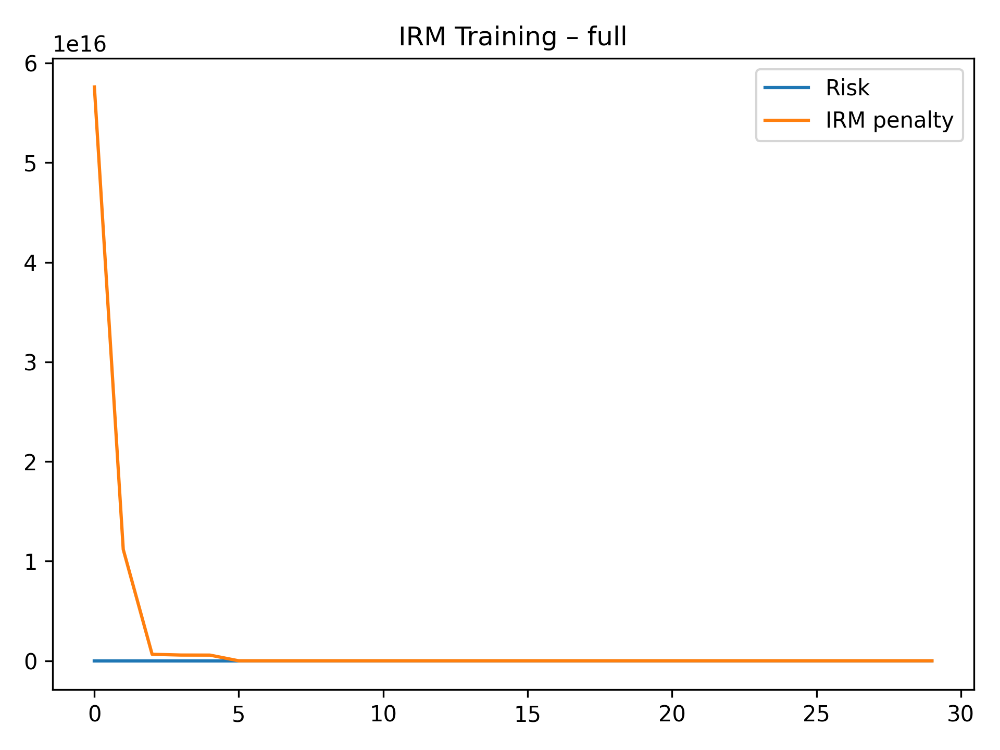
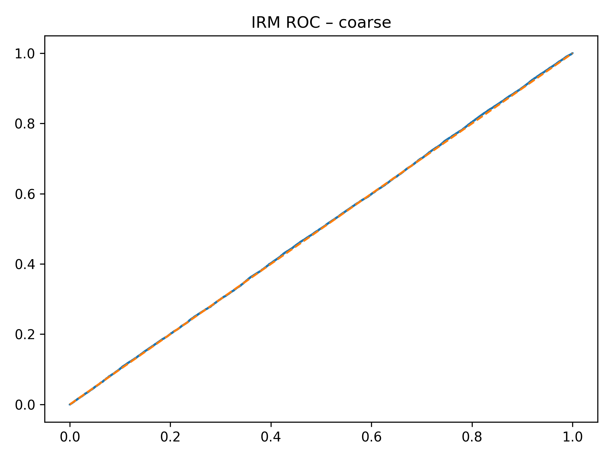
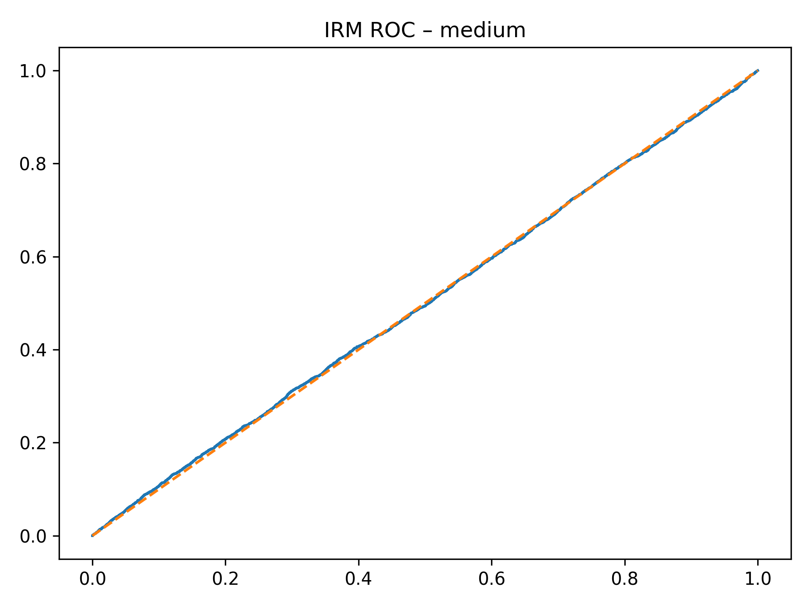
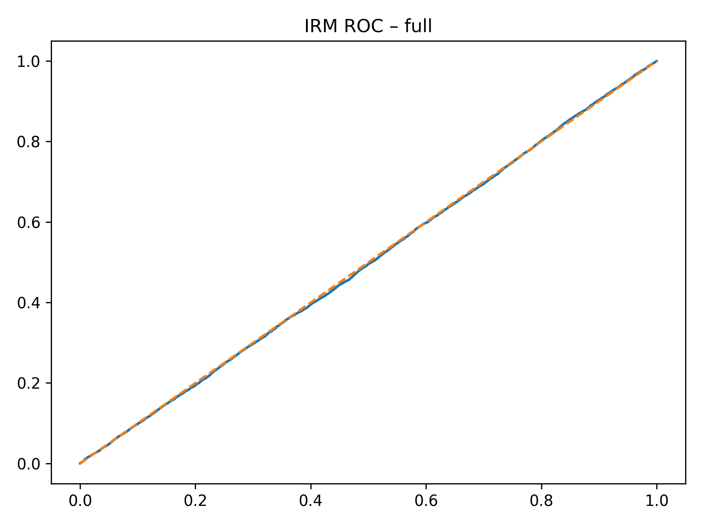

# Section C — Invariant Risk Minimization (IRM)

This directory contains **Invariant Risk Minimization (IRM) models, training diagnostics,
ROC curves, and evaluation summaries** used in **Section C** of the
*Causal-Invariant Digital Twin (CIDT)* study.

All figures are **explicitly embedded** below to ensure they render correctly on GitHub.

---

## 📄 Text Results and Analysis

### ERM vs IRM under Environment Shift
**File:** `ERM_vs_IRM_under_Environment_Shift.txt`

Provides a direct comparison between ERM and IRM performance under:
- Environment distribution shifts
- Unseen operating conditions

Used to demonstrate **risk stability advantages of IRM**.

---

### IRM Results Across Granularities
**File:** `SectionC_IRM_All_Granularities.txt`

Contains quantitative results for IRM trained at:
- Coarse
- Medium
- Full environment granularity

Metrics include AUROC, accuracy, and robustness indicators.

---

## 📊 IRM Training Dynamics (Rendered)

### Coarse Granularity Training

### Medium Granularity Training

### Full Granularity Training

These plots illustrate:
- Convergence behavior of IRM objectives
- Stability across environment partitions

---

## 📈 IRM ROC Curves (Rendered)

### Coarse Granularity ROC

### Medium Granularity ROC

### Full Granularity ROC

These ROC curves demonstrate **invariance-aware generalization** compared to ERM baselines.

---

## 🧠 Trained IRM Models

| Model | File |
|------|------|
| IRM (Coarse) | `irm_model_coarse.pt` |
| IRM (Medium) | `irm_model_medium.pt` |
| IRM (Full) | `irm_model_full.pt` |

All models are trained using environment-wise risk penalties as defined in IRM theory.

---

## 📌 Artifact Summary

| Category | Files |
|--------|------|
| Training Figures | `irm_training_coarse.png`, `irm_training_medium.png`, `irm_training_full.png` |
| ROC Figures | `irm_roc_coarse.png`, `irm_roc_medium.png`, `irm_roc_full.png` |
| Models | `irm_model_coarse.pt`, `irm_model_medium.pt`, `irm_model_full.pt` |
| Text Results | `ERM_vs_IRM_under_Environment_Shift.txt`, `SectionC_IRM_All_Granularities.txt` |
| Documentation | `readme.md` |

---

## 🔍 Role in CIDT Framework

This section establishes that:
- ERM fails under environment shift
- IRM improves invariance but remains correlation-bound
- Motivates the need for **causal representation learning and interventional twins** (CIDT)

IRM serves as the **bridge** between baseline ERM models (Section B) and causal digital twin models (Sections D–E).

---

## 📖 Related Paper Section
**Section:** Section C — Invariant Risk Minimization  
**Project:** Causal-Invariant Digital Twin for Robust Autonomous Decision Validation

