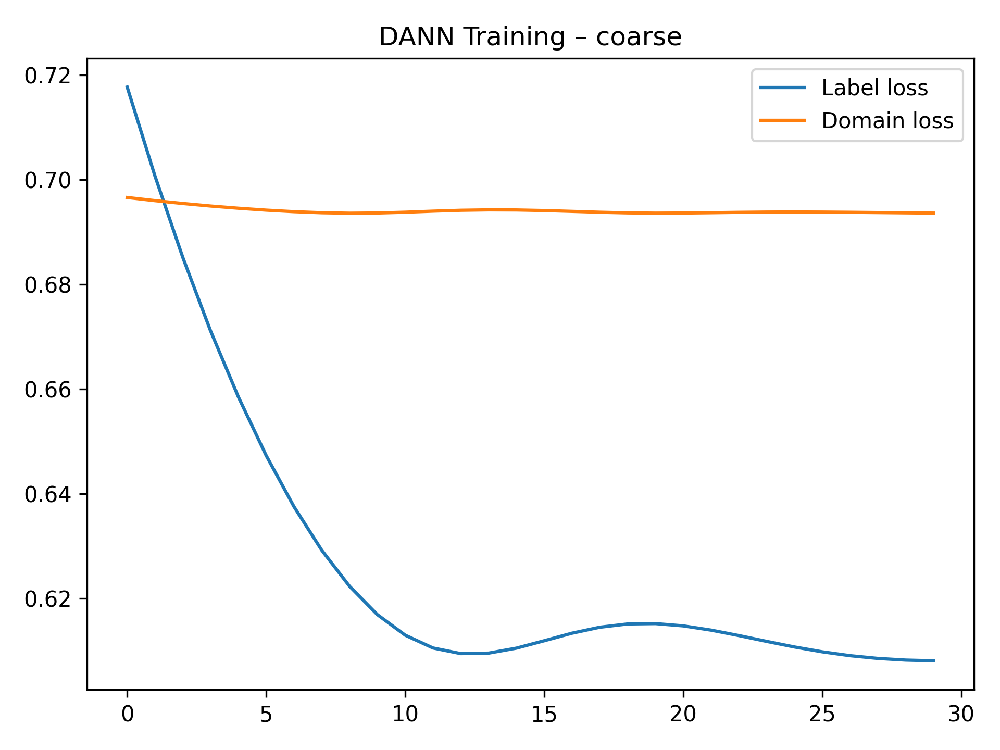
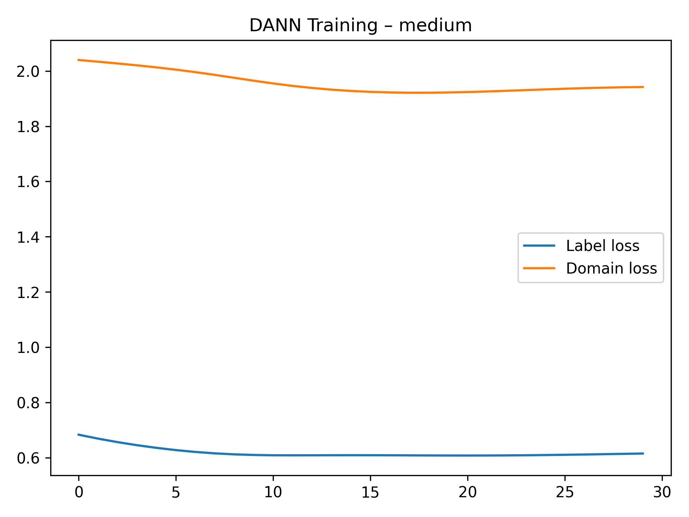
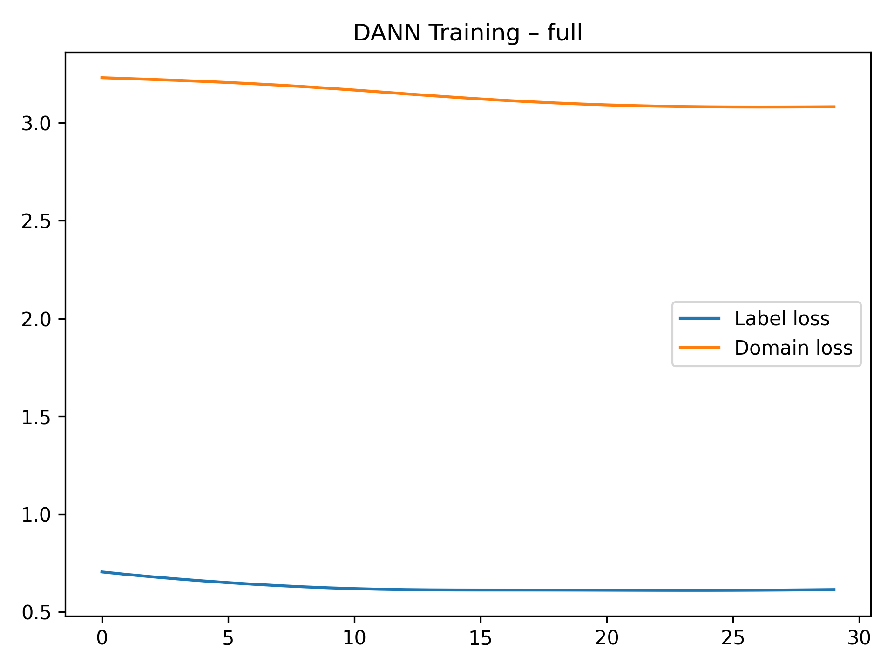
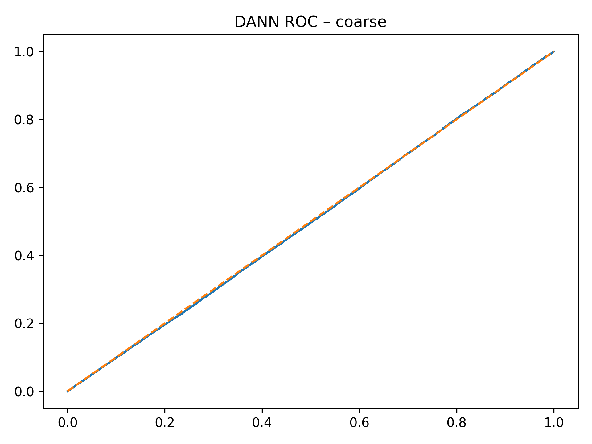
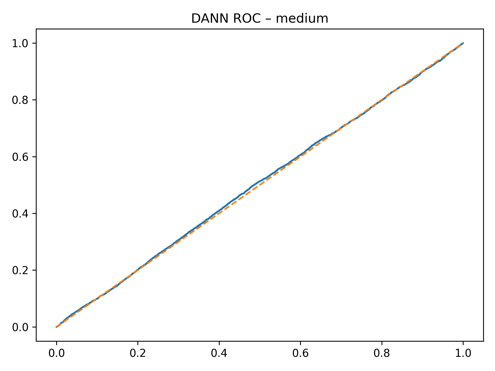
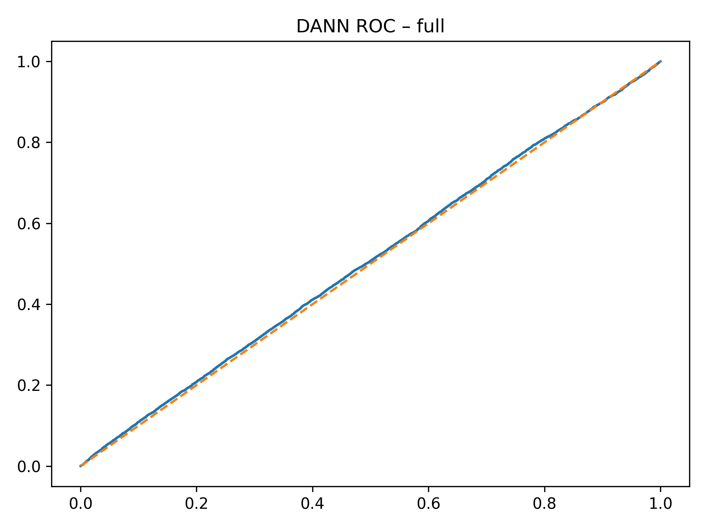

# Section D — Domain-Adversarial Neural Network (DANN)

This directory contains **Domain-Adversarial Neural Network (DANN) models,
training diagnostics, ROC curves, and result tables** used in **Section D**
of the *Causal-Invariant Digital Twin (CIDT)* study.

All figures are **explicitly embedded below** to ensure they render correctly on GitHub.

---

## 📄 Tabular Results (Structured Files)

### Aggregated Results Across Granularities
**File:** `SectionD_DANN_All_Granularities.xlsx`

Contains consolidated DANN results across:
- Coarse environment partitioning
- Medium environment partitioning
- Full environment partitioning

Metrics include AUROC, accuracy, and domain robustness indicators.

---

### Per-Granularity CSV Results
- `dann_results_coarse.csv`
- `dann_results_medium.csv`
- `dann_results_full.csv`

These files provide experiment-level metrics used to generate figures and tables in the paper.

---

## 📊 DANN Training Dynamics (Rendered)

### Coarse Granularity Training

### Medium Granularity Training

### Full Granularity Training

These figures illustrate:
- Adversarial convergence behavior
- Domain classifier loss vs task loss trade-offs
- Training instability under fine-grained environments

---

## 📈 DANN ROC Curves (Rendered)

### Coarse Granularity ROC

### Medium Granularity ROC

### Full Granularity ROC

ROC curves show that DANN improves over ERM but fails to ensure invariance under severe shifts.

---

## 🧠 Trained DANN Models

| Granularity | Model File |
|------------|-----------|
| Coarse | `dann_model_coarse.pt` |
| Medium | `dann_model_medium.pt` |
| Full | `dann_model_full.pt` |

Models are trained using gradient reversal for domain confusion.

---

## 📌 Artifact Summary

| Category | Files |
|--------|------|
| Training Figures | `dann_training_coarse.png`, `dann_training_medium.png`, `dann_training_full.png` |
| ROC Figures | `dann_roc_coarse.png`, `dann_roc_medium.png`, `dann_roc_full.png` |
| Models | `dann_model_coarse.pt`, `dann_model_medium.pt`, `dann_model_full.pt` |
| Tables | `SectionD_DANN_All_Granularities.xlsx` |
| CSV Results | `dann_results_coarse.csv`, `dann_results_medium.csv`, `dann_results_full.csv` |
| Documentation | `readme.md` |

---

## 🔍 Role in CIDT Framework

This section demonstrates that:
- Domain-adversarial alignment reduces but does not eliminate spurious correlations
- DANN struggles under fine-grained environment shifts
- Adversarial invariance is insufficient without causal structure

These limitations motivate the **causal-invariant and interventional digital twin models**
introduced in subsequent sections.

---

## 📖 Related Paper Section
**Section:** Section D — Domain-Adversarial Learning  
**Project:** Causal-Invariant Digital Twin for Robust Autonomous Decision Validation

