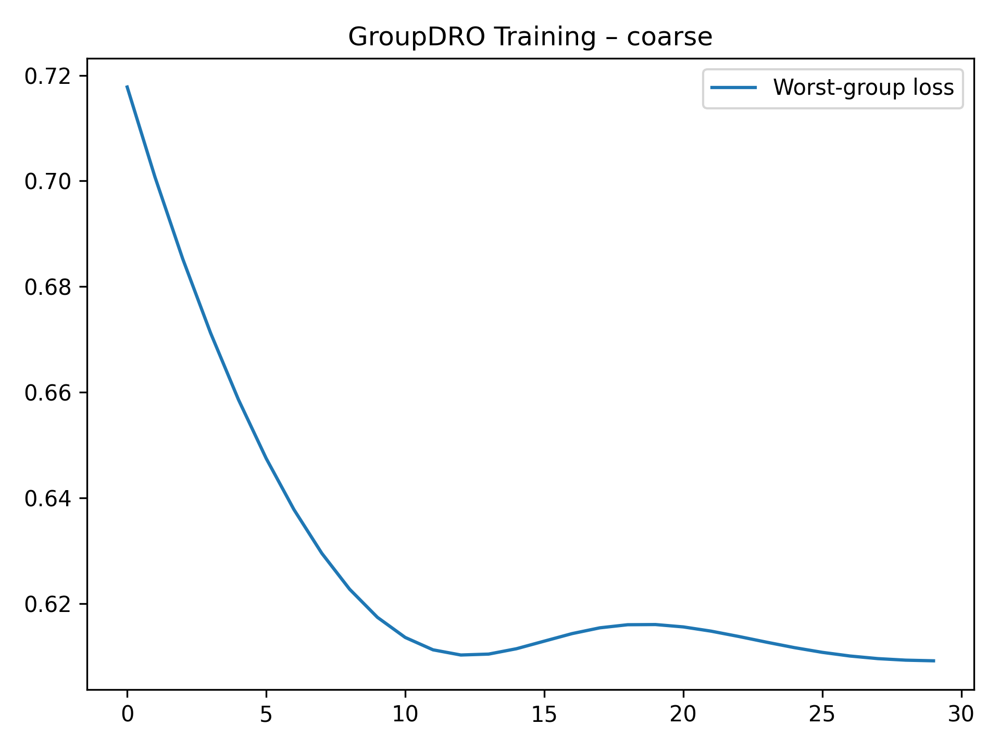
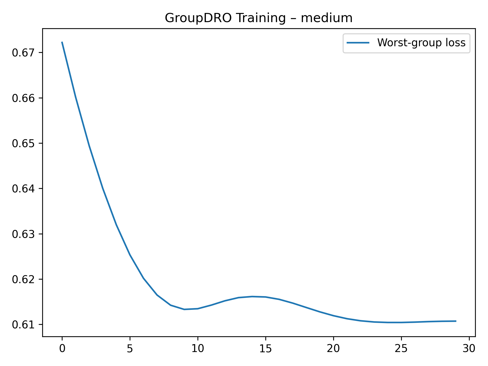
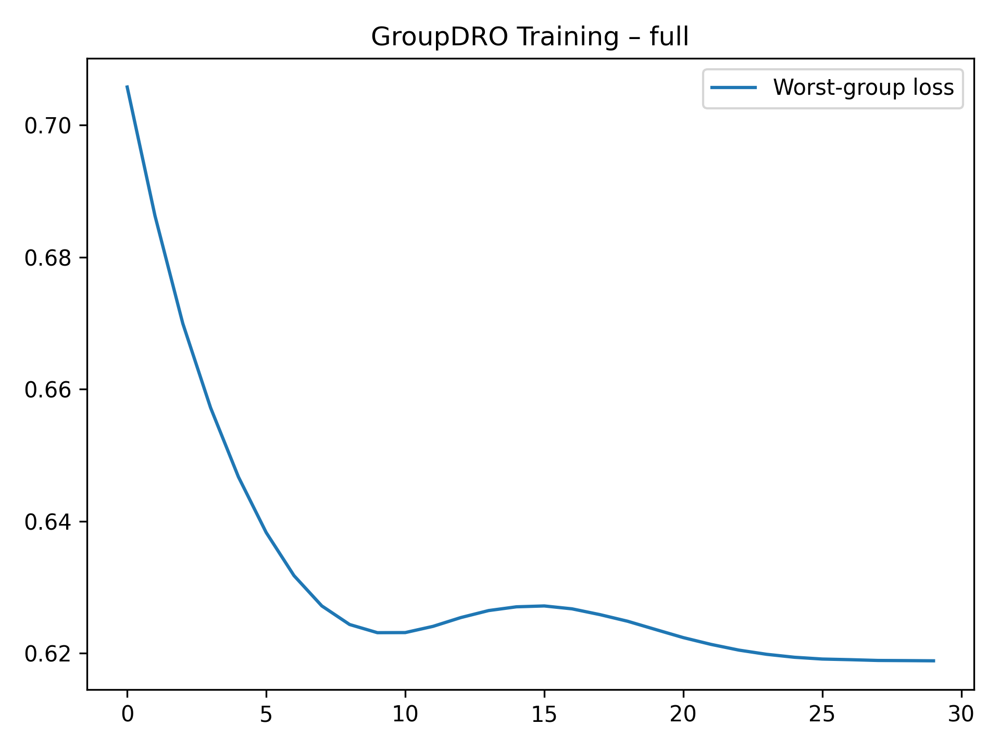
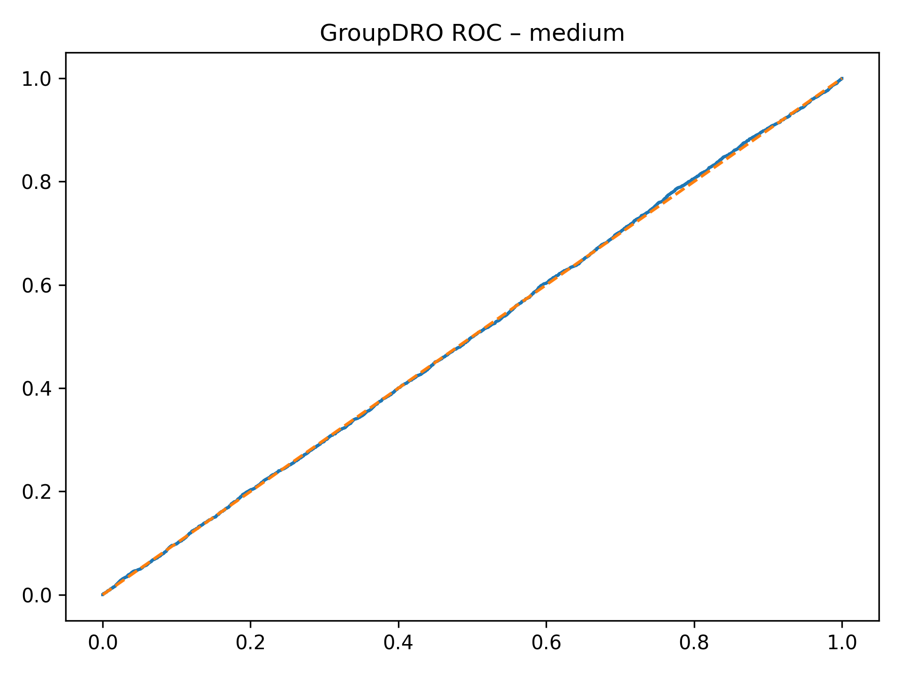
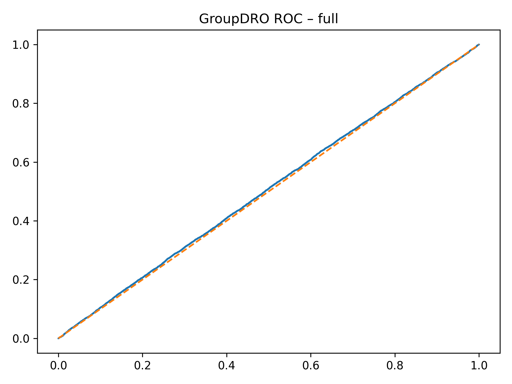

# Section E — Group Distributionally Robust Optimization (GroupDRO)

This directory contains **Group Distributionally Robust Optimization (GroupDRO) models,
training diagnostics, ROC curves, and result tables** used in **Section E**
of the *Causal-Invariant Digital Twin (CIDT)* study.

All figures are **explicitly embedded below** to ensure they render correctly on GitHub.

---

## 📄 Tabular Results

### Aggregated Results Across Granularities
**Files:**
- `SectionE_GroupDRO_All_Granularities.xlsx`
- `SectionE_GroupDRO_All_Granularities.txt`

These files report GroupDRO performance across:
- Coarse environment groups
- Medium environment groups
- Full environment groups

Metrics include AUROC, worst-group risk, accuracy, and robustness indicators.

---

## 📊 GroupDRO Training Dynamics (Rendered)

### Coarse Granularity Training

### Medium Granularity Training

### Full Granularity Training

These figures illustrate:
- Worst-group loss optimization behavior
- Training instability under fine-grained grouping
- Sensitivity to group imbalance

---

## 📈 GroupDRO ROC Curves (Rendered)

### Coarse Granularity ROC

### Medium Granularity ROC

### Full Granularity ROC

ROC curves show that GroupDRO improves worst-group risk
but sacrifices global discrimination and stability.

---

## 🧠 Trained GroupDRO Models

| Granularity | Model File |
|------------|-----------|
| Coarse | `group_dro_coarse.pt` |
| Medium | `group_dro_medium.pt` |
| Full | `group_dro_full.pt` |

Models are trained using worst-group risk minimization.

---

## 📌 Artifact Summary

| Category | Files |
|--------|------|
| Training Figures | `group_dro_training_coarse.png`, `group_dro_training_medium.png`, `group_dro_training_full.png` |
| ROC Figures | `group_dro_roc_coarse.png`, `group_dro_roc_medium.png`, `group_dro_roc_full.png` |
| Models | `group_dro_coarse.pt`, `group_dro_medium.pt`, `group_dro_full.pt` |
| Tables | `SectionE_GroupDRO_All_Granularities.xlsx`, `SectionE_GroupDRO_All_Granularities.txt` |
| Documentation | `readme.md` |

---

## 🔍 Role in CIDT Framework

This section demonstrates that:
- Worst-group optimization improves fairness metrics
- GroupDRO remains correlation-driven
- Severe performance collapse occurs under sparse or unseen groups

These limitations motivate **causal-invariant and interventional digital twin modeling**
introduced in later sections.

---

## 📖 Related Paper Section
**Section:** Section E — Worst-Group Risk Minimization  
**Project:** Causal-Invariant Digital Twin for Robust Autonomous Decision Validation

