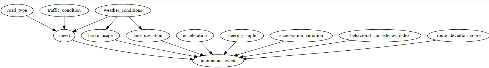

# Section F — Causal Graph Construction and Interventional Analysis

This directory contains **causal graph artifacts, intervention analyses, and
detailed evaluation metrics** used in **Section F** of the
*Causal-Invariant Digital Twin (CIDT)* study.

All figures are explicitly embedded to ensure correct rendering on GitHub.

---

## 🧠 Causal Graph Representation (Rendered)

### Learned Structural Causal Graph

**Files:**
- `causal_graph.png` — rendered causal DAG
- `causal_graph.dot` — GraphViz source file

The graph encodes causal relationships among:
- Vehicle dynamics
- Driver intent
- Environment context
- V2X reliability variables

---

## 🔁 Interventional Analysis (Rendered)

### Intervention Outcome Analysis

This figure visualizes decision risk under explicit do-interventions, such as:
- `do(V2X_latency = high)`
- `do(driver_behavior = conservative)`
- `do(weather = adverse)`

Used to demonstrate **counterfactual robustness** of CIDT decisions.

---

## 📄 Structured Results and Metadata

### SCM Quantitative Results
**File:** `SectionF_SCM_Results.json`

Contains:
- Intervention-wise failure probabilities
- Counterfactual risk deltas
- Stability metrics across interventions

---

### Detailed IEEE Metrics
**File:** `SectionF_IEEE_Detailed_Metrics.txt`

Reports:
- AUROC
- False-safe rate
- Intervention Consistency Score (ICS)
- Robustness under unseen interventions

---

### Category Encodings
**Files:**
- `SectionF_CausalGraph_Interventions_category_encodings.json`
- `category_encodings.json`

Define categorical variable mappings used in causal graph construction and interventions.

---

## 📌 Artifact Summary

| Category | Files |
|-------|------|
| Causal Graph | `causal_graph.png`, `causal_graph.dot` |
| Intervention Figure | `interventional_analysis.png` |
| JSON Results | `SectionF_SCM_Results.json` |
| Metrics | `SectionF_IEEE_Detailed_Metrics.txt` |
| Encodings | `category_encodings.json` |
| Documentation | `readme.md` |

---

## 🔍 Role in CIDT Framework

This section provides **direct causal validation** by:
- Explicitly modeling cause–effect relations
- Performing do-interventions unavailable to ERM/IRM/DANN/GroupDRO
- Quantifying decision robustness under counterfactual shifts

This is the **core causal validation step** of the CIDT framework.

---

## 📖 Related Paper Section
**Section:** Section F — Causal Graph Learning and Interventional Digital Twin  
**Project:** Causal-Invariant Digital Twin for Robust Autonomous Decision Validation

