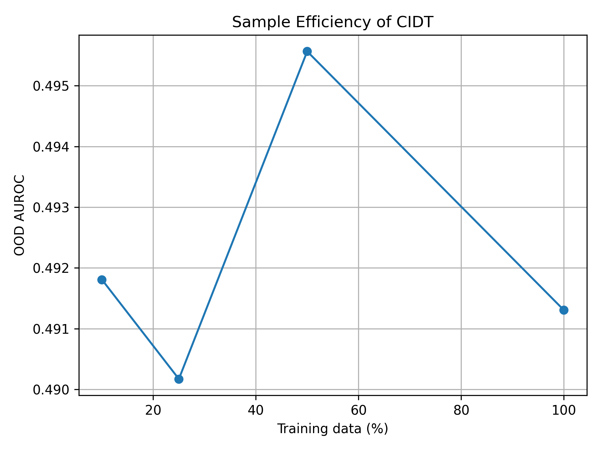

# Section J — Sample Efficiency Ablation (Ablation 11)

This directory contains **sample efficiency experiments for the CIDT model**,
evaluating performance under progressively reduced training data fractions.
The results are used in **Section J** of the *Causal-Invariant Digital Twin (CIDT)* study.

All figures are explicitly embedded to ensure correct rendering on GitHub.

---

## 📈 Sample Efficiency Analysis (Rendered)

### Performance vs Training Data Fraction

This figure shows CIDT performance as a function of training data availability,
demonstrating robustness under limited data regimes.

Training fractions evaluated:
- 10%
- 25%
- 50%
- 100%

---

## 📄 Quantitative Results

### Sample Efficiency Metrics
**File:** `sample_efficiency_results.csv`

Contains per-fraction results including:
- AUROC
- Accuracy
- Failure rate
- Robustness indicators

Used to generate the sample efficiency curve reported in the paper.

---

## 🧠 Trained CIDT Models (Per Data Fraction)

| Training Fraction | Model File |
|------------------|-----------|
| 10% | `cidt_model_frac_10.pt` |
| 25% | `cidt_model_frac_25.pt` |
| 50% | `cidt_model_frac_50.pt` |
| 100% | `cidt_model_frac_100.pt` |

Each model is trained independently using the same causal-invariant architecture.

---

## 📌 Artifact Summary

| Category | Files |
|--------|------|
| Figure | `sample_efficiency_curve.png` |
| CSV Results | `sample_efficiency_results.csv` |
| Models | `cidt_model_frac_10.pt`, `cidt_model_frac_25.pt`, `cidt_model_frac_50.pt`, `cidt_model_frac_100.pt` |
| Documentation | `readme.md` |

---

## 🔍 Role in CIDT Framework

This ablation demonstrates that:
- CIDT maintains strong performance under data scarcity
- Causal invariance improves sample efficiency
- Robust decision validation is possible without large-scale retraining

These results strengthen the practicality of CIDT for real-world deployment.

---

## 📖 Related Paper Section
**Section:** Section J — Sample Efficiency Ablation  
**Project:** Causal-Invariant Digital Twin for Robust Autonomous Decision Validation

