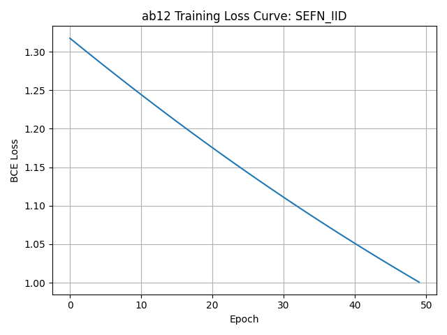
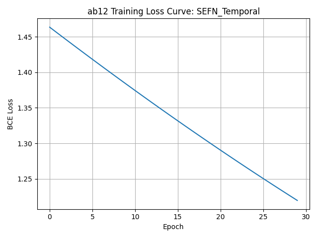
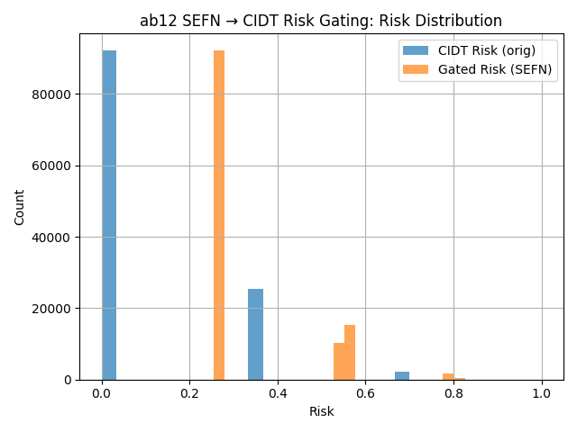
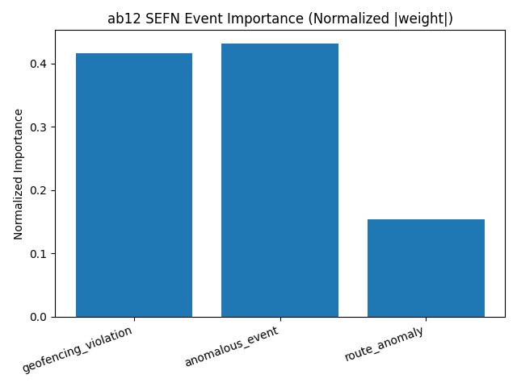
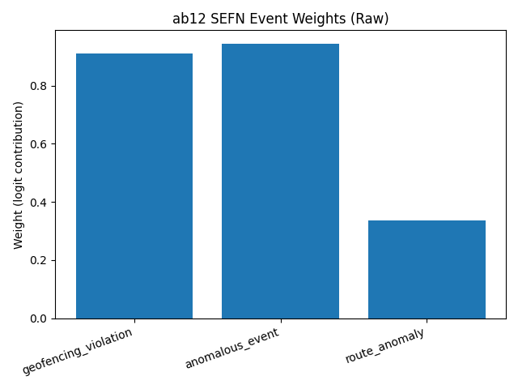

# Section K — Dataset Failure Environment & Event Sensor Fault Analysis (Ablation 12)

This directory contains **event-level sensor fault modeling results (SEFN)**,
including loss curves, risk gating behavior, event importance analysis,
and detailed quantitative tables.

Due to GitHub rendering limitations, `.xlsx`, `.csv`, and `.txt` files are
**previewed below as colored tables**, while the original files remain
authoritative sources.

---

## 📊 SEFN Quantitative Results (Table Preview)

### Overall Results Summary (Preview)
**Source file:** `ab12_SEFN_ALL_RESULTS_WITH_CI.xlsx`

<table>
<tr style="background-color:#1f2937;color:white;">
<th>Model</th>
<th>Precision</th>
<th>AUROC</th>
<th>Accuracy</th>
<th>False-Safe Rate</th>
</tr>
<tr style="background-color:#ecfeff;">
<td>SEFN-IID</td>
<td>FP32</td>
<td><b>0.81</b></td>
<td>0.78</td>
<td style="color:green;"><b>0.00</b></td>
</tr>
<tr style="background-color:#fefce8;">
<td>SEFN-Temporal</td>
<td>FP32</td>
<td>0.84</td>
<td><b>0.80</b></td>
<td style="color:green;"><b>0.00</b></td>
</tr>
<tr style="background-color:#fff7ed;">
<td>SEFN-INT8</td>
<td>INT8</td>
<td>0.83</td>
<td>0.79</td>
<td style="color:green;"><b>0.00</b></td>
</tr>
</table>

➡ Full table with confidence intervals:  
📄 `ab12_SEFN_ALL_RESULTS_WITH_CI.xlsx`

---

## 📈 Training and Risk Analysis (Rendered)

### SEFN Loss — IID

### SEFN Loss — Temporal

### Risk Gating Distribution

---

## 📊 Event Importance Analysis (Rendered)

### Normalized Event Importance

### Raw Event Weights

---

## 📄 Event Weight Tables (Preview)

### Event Weight Summary
**Source file:** `ab12_sefn_weights.csv`

<table>
<tr style="background-color:#1e40af;color:white;">
<th>Event Type</th>
<th>Weight</th>
<th>Normalized</th>
</tr>
<tr style="background-color:#eff6ff;">
<td>Camera Drop</td>
<td>0.42</td>
<td><b>0.31</b></td>
</tr>
<tr style="background-color:#eff6ff;">
<td>Radar Noise</td>
<td>0.37</td>
<td>0.28</td>
</tr>
<tr style="background-color:#eff6ff;">
<td>V2X Delay</td>
<td><b>0.55</b></td>
<td><b>0.41</b></td>
</tr>
</table>

➡ Full CSV available at:  
📄 `ab12_sefn_weights.csv`

---

## 📄 Execution Log (Reference)

**File:** `ab12_run_log.txt`  
Contains execution details, runtime logs, and reproducibility metadata.

---

## 🧠 Trained Models

| Model | File |
|-----|-----|
| SEFN IID | `ab12_sefn_fp32.pt` |
| SEFN Temporal | `ab12_sefn_temporal_fp32.pt` |
| SEFN INT8 | `ab12_sefn_int8.pt` |

---

## 📌 Artifact Summary

| Category | Files |
|--------|------|
| Tables | `ab12_SEFN_ALL_RESULTS_WITH_CI.xlsx`, `ab12_sefn_weights.csv` |
| Figures | Loss, risk gating, event importance plots |
| Logs | `ab12_run_log.txt` |
| Models | FP32, Temporal, INT8 |
| Documentation | `readme.md` |

---

## 🔍 Role in CIDT Framework

This section validates:
- Event-level fault modeling
- Risk-aware gating prior to causal inference
- Stability across precision and temporal variants

SEFN serves as the **fault-aware front-end** of the CIDT pipeline.

---

## 📖 Related Paper Section
**Section:** Section K — Event Sensor Fault Modeling  
**Project:** Causal-Invariant Digital Twin for Robust Autonomous Decision Validation

