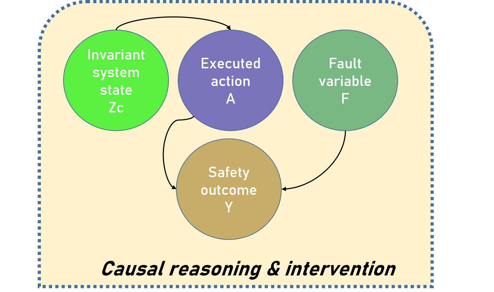

# Figures — Causal-Invariant Digital Twin (CIDT)

This directory contains **all primary figures used in the paper**  
*Causal-Invariant Digital Twin for Robust Autonomous Decision Validation under 5G-V2X Distribution Shifts*.

All figures are embedded below to ensure **inline rendering on GitHub** and
easy navigation for reviewers.

---

## 🧠 Framework & Causal Modeling

### Causal-Invariant Digital Twin (CIDT) Architecture

### Structural Causal Twin Model

### Learned Causal Graph

---

## 🔁 Causal Effects & Decomposition

### Causal Effect Decomposition

### Loss Decomposition Analysis

These figures illustrate how CIDT separates invariant causal effects
from spurious correlations.

---

## 📊 Baseline vs Robust vs Causal Comparisons

### ERM vs IRM

### DANN Performance

### GroupDRO Performance

### Predictive vs Invariant Models (All Metrics)

---

## ⚠️ Fault Modeling & Event Analysis

### SEFN Architecture

### Radar + Event Importance (SEFN Ablation)

### Fault Classification Comparison

---

## ⚖️ Ethical AI & Fairness

### Group-wise Fairness Metrics

---

## 🌍 Dataset & Environment Analysis

### Environment Distribution (with Legend)

---

## 📈 Sample Efficiency & Convergence

### AUROC Convergence vs Sample Size

---

## 📊 Aggregated Results

### Section G — Grouped Bar Results

